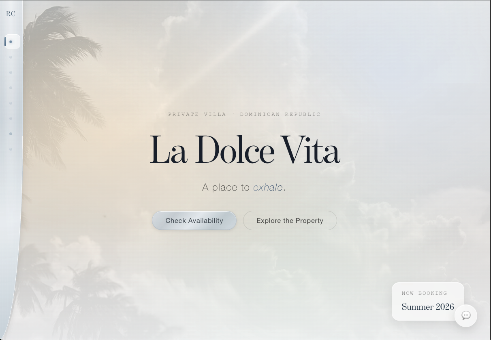
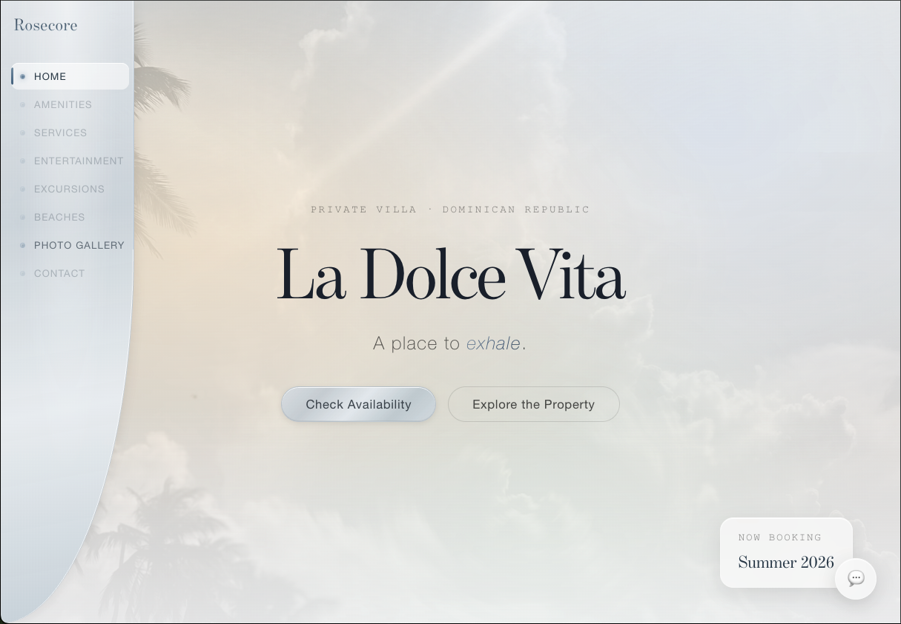
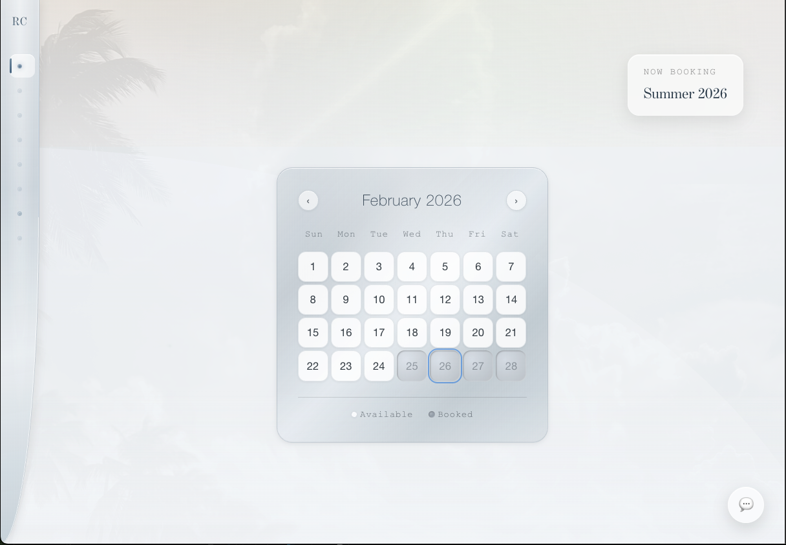
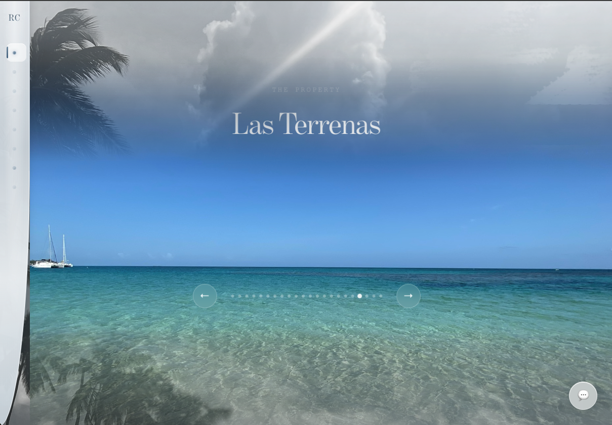
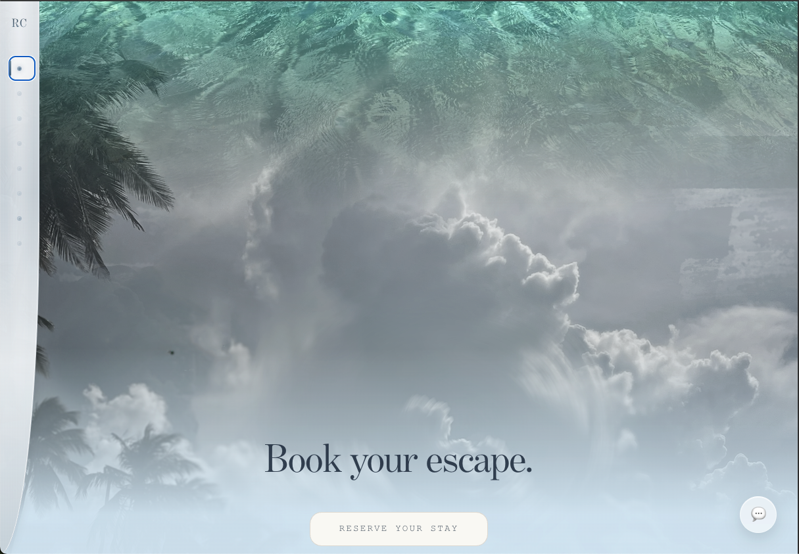
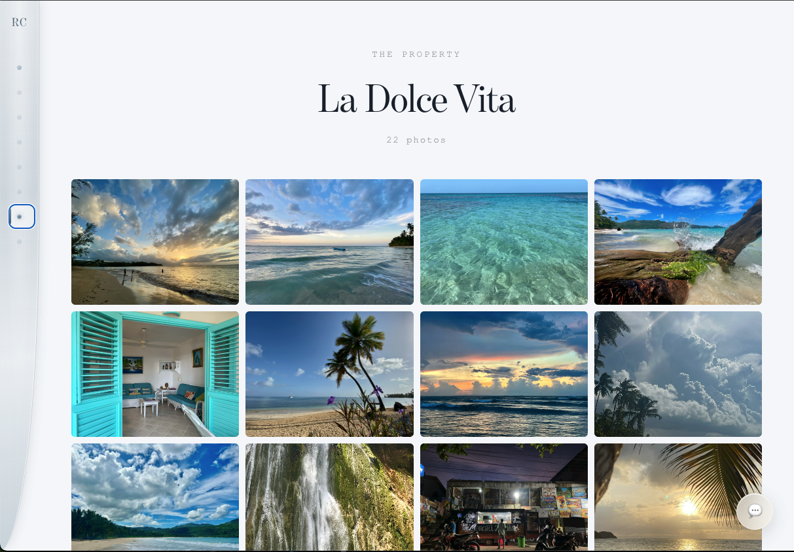
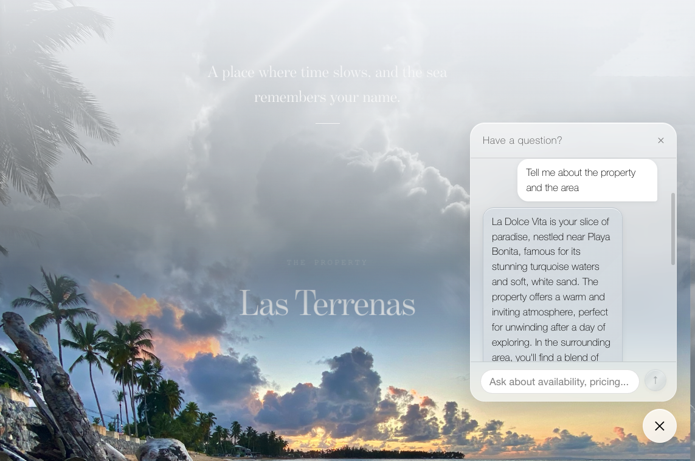
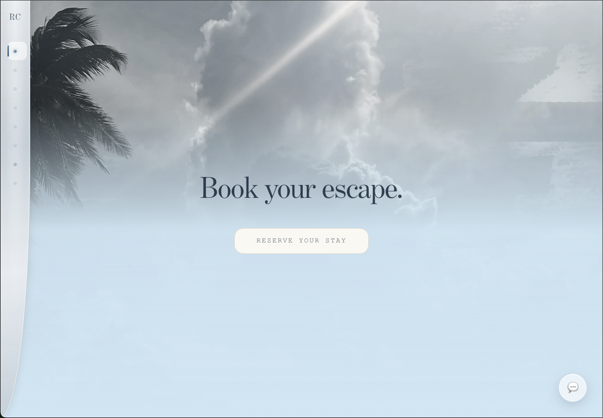

# Rosecore — La Dolce Vita

A premium vacation rental website built for a private villa in Las Terrenas, Dominican Republic. The client is listed on Airbnb but wanted a dedicated branded site that gives potential guests a richer, more personal experience — with an AI concierge, real-time availability, and a visual identity that matches the quality of the property itself.

When guests are ready to book, they're redirected to the Airbnb listing. The goal is brand differentiation and direct marketing control, not replacing Airbnb.

---

## Screenshots

**Hero — parallax landing**
The villa name floats over a full-viewport parallax background. The property photo is fixed via `background-attachment: fixed`, creating depth as the page scrolls over it.



---

**Expanded sidenav**
The nav expands on hover from a slim 60px rail into a full labeled menu, with a platinum brushed-metal finish and a curved bottom-right edge.



---

**Availability calendar**
A custom month-view calendar rendered against the live Airbnb iCal feed. Blocked dates are marked in real time. The platinum card sits over the parallax background.



---

**Photo gallery — scroll transition (entry)**
The gallery fades in as the user scrolls down, with a Ken Burns zoom-and-drift animation on each slide and a scroll-driven scale transition at entry.



**Photo gallery — scroll transition (exit)**
As the user continues scrolling, the gallery dissolves into the CTA section below — the turquoise water photo drifts upward while the page mist fades in over it.



---

**Photo gallery page**
A full-page masonry-style grid of property and location photos with a lightbox viewer.



---

**AI concierge chatbot**
The glassmorphic chat panel open mid-conversation. The bot answered a freeform question about the property and area in natural language, powered by GPT-4o-mini with Google Sheets context.



---

**Book your escape — Airbnb redirect**
The CTA section at the bottom of the page. "Reserve your stay" redirects guests to the Airbnb listing to complete their booking.



---

## What It Does

### AI Concierge Chatbot
An embedded chat widget powered by OpenAI GPT-4o-mini. Guests can ask anything — property amenities, house rules, local restaurant recommendations, activities, transportation, or availability — and get a natural, helpful response. The bot automatically detects and responds in **English, Spanish, or French** based on the guest's language.

Property details (check-in instructions, Wi-Fi info, amenities, house rules, local recommendations) live in a **Google Sheet the client manages directly**. No code deployments needed when the client updates their info — the server fetches and caches the sheet with a 5-minute TTL.

### Real-Time Availability
Integrates with the **Airbnb iCal feed** to show live booking availability. Includes a custom natural language date parser that understands inputs like:
- `"Is March 15th available?"`
- `"What about March 15-20?"`
- `"First week of April"`

Dates are extracted, checked against the live calendar, and answered naturally in the chat.

### Smart Response Routing
Common questions (pricing, check-in/out times, amenities, pets, location) are handled instantly via **keyword matching** — no AI call, no latency, no cost. OpenAI only activates for freeform or complex questions. This keeps the experience fast and the API bill low.

### Conversation Logging
Every chat exchange is saved to **MongoDB Atlas** with a session ID and timestamp. The client can review what guests are actually asking about — a feedback loop for improving the site and understanding demand.

### Client-Managed Content
The entire knowledge base lives in a Google Sheet. The client updates it like a spreadsheet. The server picks up changes automatically within 5 minutes. No developer involvement required for day-to-day content updates.

### Visual Identity
- Glassmorphic UI with warm platinum brushed-metal accents
- Ken Burns photo gallery with keyboard/touch navigation
- Custom availability calendar with blocked-date rendering
- Scroll-driven transitions between page sections
- Mobile-first, fully responsive

---

## Tech Stack

| Layer | Technology |
|---|---|
| Frontend | React 18, Vite, plain CSS |
| Backend | Express.js, Node 22 |
| AI | OpenAI GPT-4o-mini |
| Availability | Airbnb iCal feed (`node-ical`) |
| Content | Google Sheets API v4 |
| Database | MongoDB Atlas (chat history) |
| Frontend Deploy | Vercel |
| Backend Deploy | Render |

---

## Architecture

```
Guest browser
    │
    ├── React frontend (Vercel)
    │       ├── Hero + photo gallery
    │       ├── Availability calendar (iCal)
    │       └── Chat widget → POST /api/chat
    │
    └── Express backend (Render)
            ├── Keyword matching (instant, no AI)
            ├── Date parser + iCal availability check
            ├── Google Sheets context fetch (5-min cache)
            ├── OpenAI GPT-4o-mini (freeform questions)
            └── MongoDB Atlas (conversation logging)
```

The backend runs a layered decision tree on every message:
1. Does it match a keyword? → Respond instantly
2. Does it contain dates? → Check iCal, respond with availability
3. Everything else → Fetch Google Sheet context, call OpenAI, log to MongoDB

---

## Local Development

### Prerequisites
- Node 18+
- npm 9+
- MongoDB Atlas connection string
- OpenAI API key
- Google Cloud service account with Sheets API enabled
- Airbnb iCal URL (from your listing's calendar export)

### Install

```bash
# From project root — installs all workspaces
npm install
```

### Environment Variables

Create `server/.env`:

```env
# Airbnb iCal feed URL
ICAL_URL=https://www.airbnb.com/calendar/ical/YOUR_LISTING_ID.ics

# OpenAI
OPENAI_API_KEY=sk-...

# MongoDB Atlas
MONGODB_URI=mongodb+srv://...

# Google Sheets
GOOGLE_SHEET_ID=your_sheet_id_here
GOOGLE_CREDENTIALS={"type":"service_account","project_id":"..."}
```

> **Never commit `.env`** — it's gitignored. The Google credentials JSON can be pasted inline as a single-line string.

### Run

```bash
# Starts both client (:5173) and server (:3001) concurrently
npm run dev
```

Client: `http://localhost:5173`
API: `http://localhost:3001`

### API Endpoints

| Method | Route | Description |
|---|---|---|
| `GET` | `/api/ical` | Returns blocked dates from Airbnb feed |
| `POST` | `/api/chat` | Accepts `{ message, sessionId }`, returns `{ reply }` |

---

## Project Structure

```
rose-core/
├── client/                  # React frontend (Vite)
│   └── src/
│       ├── components/
│       │   ├── AvailabilityCalendar/
│       │   ├── ChatWidget/
│       │   ├── Gallery/
│       │   ├── Hero/
│       │   ├── SectionDivider/
│       │   └── SideNav/
│       ├── pages/
│       │   ├── HomePage/
│       │   └── GalleryPage/
│       └── styles/          # Design tokens, global styles
├── server/                  # Express backend
│   ├── routes/
│   │   ├── chat.js          # Chat endpoint + date parser
│   │   └── ical.js          # Availability endpoint
│   └── lib/
│       ├── getBlockedDates.js  # iCal fetcher (shared)
│       ├── openaiChat.js       # OpenAI integration
│       ├── googleSheets.js     # Sheets client + cache
│       └── chatHistory.js      # MongoDB logging
└── docs/
    └── stretch-goals.md     # Planned features
```

---

## Deployment

**Frontend (Vercel):** Connect the repo, set the root directory to `client/`, build command `npm run build`, output `dist/`.

**Backend (Render):** Connect the repo, set root to `server/`, start command `node index.js`. Add all environment variables in the Render dashboard.

The `vercel.json` at the project root rewrites `/api/*` requests to the Render backend so the frontend can call `/api/chat` without hardcoding URLs.

---

## Context

This is a real client project. The property — La Dolce Vita — is a private villa in Las Terrenas, Samana Peninsula, Dominican Republic. The client wanted to move beyond a plain Airbnb listing and build a direct web presence that reflects the quality of the property, captures guest intent earlier in the research process, and gives them ownership over their brand and messaging.

The site is designed to feel like the property itself: unhurried, elegant, and genuinely helpful.
